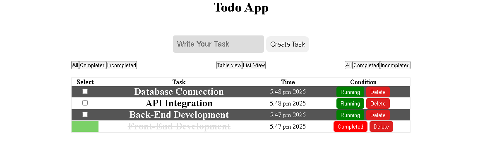

# ✅ React To-Do App

A simple and functional To-Do List application built with **React** and **Vite**, styled using **CSS**. Users can add new tasks, switch between **list view** and **table view**, mark tasks as completed, and delete tasks. The app dynamically updates task status and provides a clean, minimal UI for managing daily tasks.

🔗 **Live Demo:** [Click Here to Try the App](https://zihaddevvault.github.io/To-Do-App/)  


---

## ✨ Features

- ➕ Add new tasks
- ✅ Mark tasks as complete (strike-through and disabled input)
- 🗑️ Delete tasks individually
- 📋 Switch between **List View** and **Table View**
- 📊 Table View shows task status (Running / Completed) and task creation time  
- 💡 Lightweight and fast (built with **Vite**)
- 🎨 Styled with custom CSS

---

## 🧪 How It Works

- **Adding a Task:**  
  Type a task name and click "Add Task" to add it to your list.

- **Completing a Task:**  
  Click the checkbox next to a task to mark it as completed. The task will be disabled and shown with a line-through style.

- **Switch View:**  
  Toggle between **List View** and **Table View** using a button.  
  - List View: Simple list with checkbox and delete button  
  - Table View: Displays tasks in a table along with their **status** (Running / Completed)

- **Deleting a Task:**  
  Click the delete/trash icon to remove a task from the list.

---

## 📁 Project Structure
```
react-todo-app/
│
├── public/
│   └── index.html              # HTML entry point
│
├── src/
│   ├── components/             # Reusable React components (e.g., TaskList, TaskTable)
    │   └── task.module.css     # App-wide CSS styles
│   ├── App.jsx                 # Main application component
│   ├── main.jsx                # App entry point rendered to DOM
│   └── index.css               # Reset CSS
│                  
│
├── .gitignore                  # Git ignore rules
├── index.html                  # Vite root HTML file
├── package.json                # Project metadata and dependencies
├── vite.config.js              # Vite build tool configuration
└── README.md                   # Project documentation ```

## 🧰 Technologies Used

- **React:** For building the user interface with reusable components and managing state.  
- **Vite:** A fast development and build tool that provides instant server start and lightning-fast hot module replacement (HMR).  
- **JavaScript (ES6+):** Modern JavaScript features used for app logic and interactivity.  
- **CSS:** Custom styling to create a clean and responsive user interface.


## 📸 Screenshot

  


## 🪄 Future Improvements

- Edit existing tasks to update descriptions  
- Save tasks locally using localStorage or backend integration  
- Add due dates and priority levels for tasks  
- Improve responsive design for mobile devices  

---

## 📜 License

This project is open-source and available under the [MIT License](LICENSE).

---

## 🙌 Author

Built with ❤️ by Md Zihad mia  
GitHub: [@ZihadDevVault](https://github.com/ZihadDevVault)  
Portfolio: [engr.zihad.vercel.app](engr.zihad.vercel.app)
